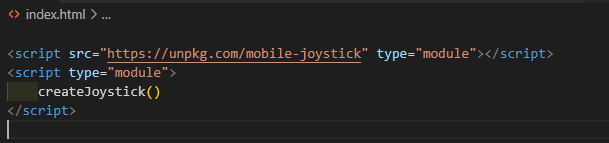

# Mobile Joystick For Pure JS

## How to start

create index.html, and add:
> ```<script src="https://unpkg.com/mobile-joystick" type="module"></script>```

> ``` <script type="module" src=`your_way`></script>``` at this file you must add lines:
- ```createJoystick()``` for create joystick and add him to screen
- ```mobileJoystick``` for get result this variables haves property:
- `x: 0,` - (between -1 and 1) for velocity 
- `y: 0,` - (between -1 and 1) for velocity
- `consolling: true,` - for return current x and y in console(change the value to false if you don't want to see it)


## Get Code

> ```npm i mobile-joystick```

> then search `node_modules/mobile-joystick/app.js`

## Pay attention!

It is only for mobile devices because work with touchmove events!
Of course it is seamply to change 


### Easy code to show change at screen
```<body>
    <div id="resultX"></div>
    <div id="resultY"></div>

</body>
<script src="https://unpkg.com/mobile-joystick" type="module"></script>
<script type="module">
    createJoystick()
    
    setInterval(() => {
        resultX.innerHTML = mobileJoystick.x
        resultY.innerHTML = mobileJoystick.y

    }, 100)

</script>```
